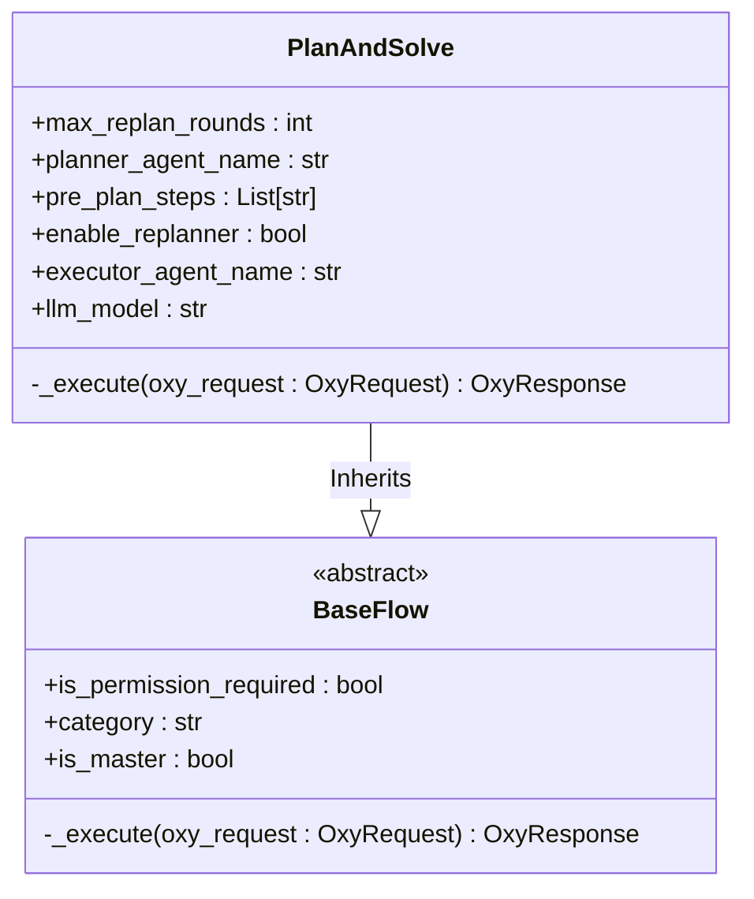
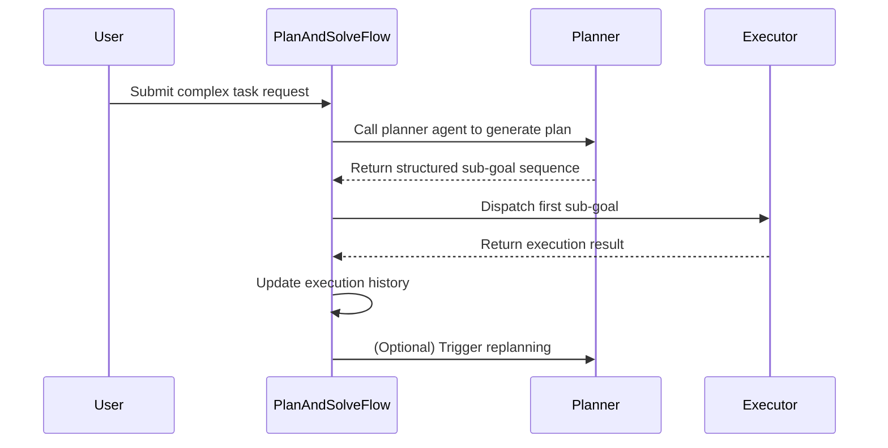

# PlanAndSolve

PlanAndSolveFlow is a workflow implementation that follows the "Plan-and-Solve" prompting pattern. It decomposes complex tasks into an ordered sequence of sub-goals and completes them through the collaboration of Planner and Executor agents.

## Overview

PlanAndSolveFlow inherits from BaseFlow and serves as the controller for the entire process. It coordinates different agents, manages task status, and triggers replanning processes when necessary to handle uncertainties during execution.

## Core Components

- **Planner Agent**: Responsible for decomposing complex tasks into ordered sub-goals
- **Executor Agent**: Responsible for executing individual sub-goals
- **Replanner** (Optional): Dynamically adjusts the execution plan based on intermediate results
- **Context Memory System**: Maintains execution history to ensure context continuity

## Architecture



## Parameters

| Parameter | Type | Default | Description |
|-----------|------|---------|-------------|
| `max_replan_rounds` | `int` | `30` | Maximum number of replanning rounds |
| `planner_agent_name` | `str` | `"planner_agent"` | Name of the planner agent |
| `executor_agent_name` | `str` | `"executor_agent"` | Name of the executor agent |
| `enable_replanner` | `bool` | `False` | Whether to enable the replanner |
| `pre_plan_steps` | `List[str]` | `None` | Predefined plan steps |
| `llm_model` | `str` | `"default_llm"` | LLM model name for fallback |

## Workflow



## Task Decomposition Algorithm

The core logic of task decomposition is implemented in the `_execute` method of the `PlanAndSolve` class. When the process receives a user request, if no predefined plan steps are provided, it first calls the planner agent to generate an initial plan.

The planner agent uses structured prompts to guide the Large Language Model (LLM) to generate an execution plan. The plan is returned in the form of a Pydantic model `Plan`, where the `steps` field is a list of strings representing sub-goals to be executed in order. The system uses `PydanticOutputParser` to ensure the LLM output conforms to the expected JSON structure, achieving reliable task decomposition.

## Context Memory Transfer Mechanism

PlanAndSolveFlow transfers context memory across multi-step planning through the `past_steps` variable. This variable accumulates records of all completed sub-goals and their execution results in string form.

Before executing each sub-goal, the system formats the content of `past_steps` into a context prompt, clearly informing the executor agent of "completed steps" and "current step to execute." This design ensures that the executor agent can fully understand the historical context when processing the current task, avoiding duplicate work or missing critical information.

Additionally, when the replanning function is enabled, the complete `past_steps` record is passed to the replanner agent, enabling it to make more informed decisions based on the global execution history, such as skipping failed paths or adjusting the priority of subsequent steps.

## Iteration Termination Mechanism

PlanAndSolveFlow provides two main iteration termination mechanisms: termination based on plan exhaustion and termination based on replanning response.

In the default mode where `enable_replanner=False`, the system uses a simple iteration approach. Each cycle executes the first sub-goal in the current plan, then removes it from the plan list. When the plan list is empty (`len(plan_steps) == 0`), the process determines the task is complete and returns the final result.

When `enable_replanner=True`, the system enables a dynamic replanning mechanism. After each execution step, the system calls the replanner agent to evaluate whether the plan needs to be updated based on the original goal, initial plan, and history of completed steps. The output of the replanner agent is an `Action` model, which can be either `Response` (indicating task completion) or a new `Plan` (indicating the need to update the plan). If a `Response` type is detected, the process terminates immediately and returns the user response.

## Configuration Example

```json
{
  "name": "master_agent",
  "is_discard_react_memory": true,
  "llm_model": "default_llm",
  "is_master": true,
  "planner_agent_name": "planner_agent",
  "executor_agent_name": "executor_agent",
  "enable_replanner": false,
  "timeout": 100,
  "max_replan_rounds": 30,
  "pre_plan_steps": null
}
```

## Collaboration with ReActAgent

PlanAndSolveFlow and ReActAgent form a typical hierarchical collaboration pattern. In this architecture, `PlanAndSolveFlow` serves as the high-level controller (master_agent), responsible for macro task decomposition and process management; while `ReActAgent` serves as the low-level executor (executor_agent), responsible for specific tool calls and atomic task execution.

In the configuration, `executor_agent` is defined as a `ReActAgent` and configured with tools like `time` and `filesystem`. This means when `PlanAndSolveFlow` dispatches a sub-goal (such as "query current time") to `executor_agent`, `ReActAgent` will initiate its internal ReAct loop to complete the sub-goal through "thought-action" iterations.

This layered design achieves separation of concerns: the high-level process focuses on "what to do," while the low-level agent focuses on "how to do it." This not only improves the modularity of the system but also allows each component to be optimized independently.

## Advanced Use Cases

### Predefined Plan Steps

The `pre_plan_steps` parameter allows users to provide predefined plan steps, bypassing the initial planning phase. This is useful when the planning logic is very clear or when strict control over the execution process is needed.

### Dynamic Replanning

The `enable_replanner` is a key switch parameter. If set to `True`, it requires configuring `replanner_agent_name` to enable more advanced dynamic adaptation capabilities.

### Maximum Replanning Rounds

The `max_replan_rounds` parameter (default value of 30) limits the maximum number of iterations to prevent the system from falling into infinite loops on complex or unsolvable tasks. Users can adjust this value based on task complexity and expected execution time.

## Common Issues and Optimization

### Circular Planning Problem

When `enable_replanner=True` and the replanning logic is inappropriate, the system may fall into an infinite loop of plan updates. The diagnostic method is to check the `past_steps` log for repeated sub-goal sequences. Optimization recommendations include ensuring the replanner agent returns the original plan when no new information is available, or forcing termination within `max_replan_rounds`.

### Sub-goal Redundancy Problem

This usually stems from poor prompt design for the planner agent. If the prompt does not clearly require "avoiding redundant steps," the LLM may generate duplicate or unnecessary sub-goals. The solution is to optimize the prompt for `planner_agent`, emphasizing the conciseness of plans and the independence of steps.

### Executor Context Confusion

The executor agent may ignore the `past_steps` context, leading to repeated execution or skipped steps. Ensure the executor agent's prompt includes clear instructions like "execute only the current step, do not skip or repeat."

## Conclusion

PlanAndSolveFlow provides a powerful and flexible mechanism for handling complex, multi-step tasks. By combining task decomposition, execution, and dynamic replanning, it can effectively address uncertain and dynamically changing problems in the real world. Its hierarchical collaboration pattern with ReActAgent demonstrates the powerful capabilities of the OxyGent framework in building complex intelligent agent systems. Proper parameter configuration and prompt optimization can significantly improve the performance and reliability of this process.

## API Reference

For complete API documentation including all constructor parameters, methods, and detailed parameter descriptions, see:

**[PlanAndSolve API Reference](/api-docs/flows-plan-and-solve-api)** - Complete API documentation

## Examples

For practical examples and usage patterns, see:

- [Basic Plan-and-Solve](/examples/flows/basic-plan-solve) - Simple multi-step task execution
- [Dynamic Replanning](/examples/flows/adaptive-planning) - Adaptive workflow with replanning
- [Predefined Workflow](/examples/flows/fixed-workflow) - Using pre_plan_steps for fixed processes

See all examples in the [Examples Gallery](/examples).

## Related Links

- [Workflow](/docs/flows-workflow) - Custom workflow execution flow
- [ParallelFlow](/docs/flows-parallel) - Parallel execution flow
- [Reflexion](/docs/flows-reflexion) - Self-evaluation and iterative improvement
- [Flow Comparison Guide](/docs/flows-comparison) - Compare all flow types
- [ReActAgent](/docs/agents-react) - Reasoning and acting agent for execution
- [ChatAgent](/docs/agents-chat) - Chat agent for planning
