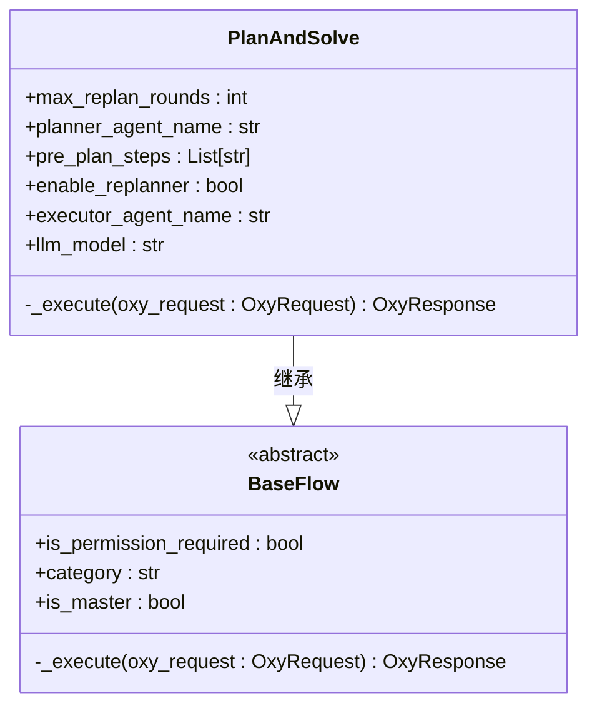
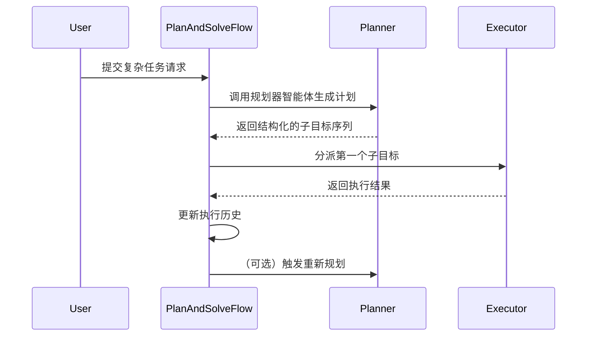

PlanAndSolveFlow 是一个遵循"计划并解决"提示模式的工作流实现。它将复杂任务分解为有序的子目标序列，并通过规划器和执行器智能体的协作来完成它们。

## 概述

PlanAndSolveFlow 继承自 BaseFlow，作为整个过程的控制器。它协调不同的智能体，管理任务状态，并在必要时触发重新规划过程以处理执行过程中的不确定性。

## 核心组件

- **规划器智能体**：负责将复杂任务分解为有序的子目标
- **执行器智能体**：负责执行单个子目标
- **重新规划器**（可选）：根据中间结果动态调整执行计划
- **上下文内存系统**：维护执行历史以确保上下文连续性

## 架构



## 参数

| 参数 | 类型 | 默认值 | 描述 |
|-----------|------|---------|-------------|
| `max_replan_rounds` | `int` | `30` | 最大重新规划轮数 |
| `planner_agent_name` | `str` | `"planner_agent"` | 规划器智能体的名称 |
| `executor_agent_name` | `str` | `"executor_agent"` | 执行器智能体的名称 |
| `enable_replanner` | `bool` | `False` | 是否启用重新规划器 |
| `pre_plan_steps` | `List[str]` | `None` | 预定义的计划步骤 |
| `llm_model` | `str` | `"default_llm"` | 用于回退的 LLM 模型名称 |

## 工作流



## 任务分解算法

任务分解的核心逻辑在 `PlanAndSolve` 类的 `_execute` 方法中实现。当流程接收到用户请求时，如果没有提供预定义的计划步骤，它首先调用规划器智能体生成初始计划。

规划器智能体使用结构化提示来引导大语言模型（LLM）生成执行计划。该计划以 Pydantic 模型 `Plan` 的形式返回，其中 `steps` 字段是表示按顺序执行的子目标的字符串列表。系统使用 `PydanticOutputParser` 确保 LLM 输出符合预期的 JSON 结构，实现可靠的任务分解。

## 上下文内存传递机制

PlanAndSolveFlow 通过 `past_steps` 变量在多步规划中传递上下文内存。该变量以字符串形式累积所有已完成子目标及其执行结果的记录。

在执行每个子目标之前，系统将 `past_steps` 的内容格式化为上下文提示，清楚地告知执行器智能体"已完成的步骤"和"当前要执行的步骤"。这种设计确保执行器智能体在处理当前任务时能够充分理解历史上下文，避免重复工作或遗漏关键信息。

此外，当启用重新规划功能时，完整的 `past_steps` 记录会传递给重新规划器智能体，使其能够根据全局执行历史做出更明智的决策，例如跳过失败的路径或调整后续步骤的优先级。

## 迭代终止机制

PlanAndSolveFlow 提供两种主要的迭代终止机制：基于计划耗尽的终止和基于重新规划响应的终止。

在默认模式 `enable_replanner=False` 中，系统使用简单的迭代方法。每个周期执行当前计划中的第一个子目标，然后从计划列表中删除它。当计划列表为空（`len(plan_steps) == 0`）时，流程判断任务完成并返回最终结果。

当 `enable_replanner=True` 时，系统启用动态重新规划机制。在每个执行步骤之后，系统调用重新规划器智能体根据原始目标、初始计划和已完成步骤的历史来评估是否需要更新计划。重新规划器智能体的输出是一个 `Action` 模型，可以是 `Response`（表示任务完成）或新的 `Plan`（表示需要更新计划）。如果检测到 `Response` 类型，流程立即终止并返回用户响应。

## 配置示例

```json
{
  "name": "master_agent",
  "is_discard_react_memory": true,
  "llm_model": "default_llm",
  "is_master": true,
  "planner_agent_name": "planner_agent",
  "executor_agent_name": "executor_agent",
  "enable_replanner": false,
  "timeout": 100,
  "max_replan_rounds": 30,
  "pre_plan_steps": null
}
```

## 与 ReActAgent 的协作

PlanAndSolveFlow 和 ReActAgent 形成典型的分层协作模式。在此架构中，`PlanAndSolveFlow` 作为高层控制器（master_agent），负责宏观任务分解和流程管理；而 `ReActAgent` 作为低层执行器（executor_agent），负责具体的工具调用和原子任务执行。

在配置中，`executor_agent` 被定义为 `ReActAgent` 并配置了 `time` 和 `filesystem` 等工具。这意味着当 `PlanAndSolveFlow` 将子目标（例如"查询当前时间"）分派给 `executor_agent` 时，`ReActAgent` 将启动其内部 ReAct 循环，通过"思考-行动"迭代来完成子目标。

这种分层设计实现了关注点分离：高层流程关注"做什么"，而低层智能体关注"如何做"。这不仅提高了系统的模块化程度，还允许每个组件独立优化。

## 高级使用场景

### 预定义计划步骤

`pre_plan_steps` 参数允许用户提供预定义的计划步骤，绕过初始规划阶段。这在规划逻辑非常清晰或需要严格控制执行过程时很有用。

### 动态重新规划

`enable_replanner` 是一个关键的开关参数。如果设置为 `True`，需要配置 `replanner_agent_name` 以启用更高级的动态适应能力。

### 最大重新规划轮数

`max_replan_rounds` 参数（默认值为 30）限制最大迭代次数，以防止系统在复杂或无法解决的任务上陷入无限循环。用户可以根据任务复杂性和预期执行时间调整此值。

## 常见问题和优化

### 循环规划问题

当 `enable_replanner=True` 且重新规划逻辑不恰当时，系统可能陷入计划更新的无限循环。诊断方法是检查 `past_steps` 日志中是否有重复的子目标序列。优化建议包括确保重新规划器智能体在没有新信息可用时返回原始计划，或在 `max_replan_rounds` 内强制终止。

### 子目标冗余问题

这通常源于规划器智能体的提示设计不佳。如果提示没有明确要求"避免冗余步骤"，LLM 可能会生成重复或不必要的子目标。解决方案是优化 `planner_agent` 的提示，强调计划的简洁性和步骤的独立性。

### 执行器上下文混淆

执行器智能体可能会忽略 `past_steps` 上下文，导致重复执行或跳过步骤。确保执行器智能体的提示包含明确的指令，如"仅执行当前步骤，不要跳过或重复"。

## 结论

PlanAndSolveFlow 提供了一个强大而灵活的机制来处理复杂的多步骤任务。通过结合任务分解、执行和动态重新规划，它可以有效地解决现实世界中不确定和动态变化的问题。其与 ReActAgent 的分层协作模式展示了 OxyGent 框架在构建复杂智能体系统方面的强大能力。适当的参数配置和提示优化可以显著提高该流程的性能和可靠性。

## API 参考

完整的 API 文档包括所有构造函数参数、方法和详细的参数描述，请参考：

**[PlanAndSolve API 参考](/oxyapi/flows-plan-and-solve-api)** - 完整的 API 文档

## 示例

实际使用示例和模式请参考：

- [基础 Plan-and-Solve](/examples/flows/basic-plan-solve) - 简单的多步骤任务执行
- [动态重新规划](/examples/flows/adaptive-planning) - 带重新规划的自适应工作流
- [预定义工作流](/examples/flows/fixed-workflow) - 使用 pre_plan_steps 的固定流程

查看所有示例：[示例库](/examples)。

## 相关链接

- [工作流](/docs/flows-workflow) - 自定义工作流执行流程
- [ParallelFlow](/docs/flows-parallel) - 并行执行流程
- [Reflexion](/docs/flows-reflexion) - 自我评估和迭代改进
- [流程对比指南](/docs/flows-comparison) - 对比所有流程类型
- [ReActAgent](/docs/agents-react) - 用于执行的推理和行动智能体
- [ChatAgent](/docs/agents-chat) - 用于规划的聊天智能体
