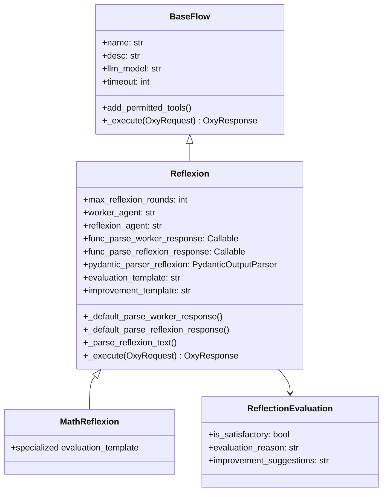
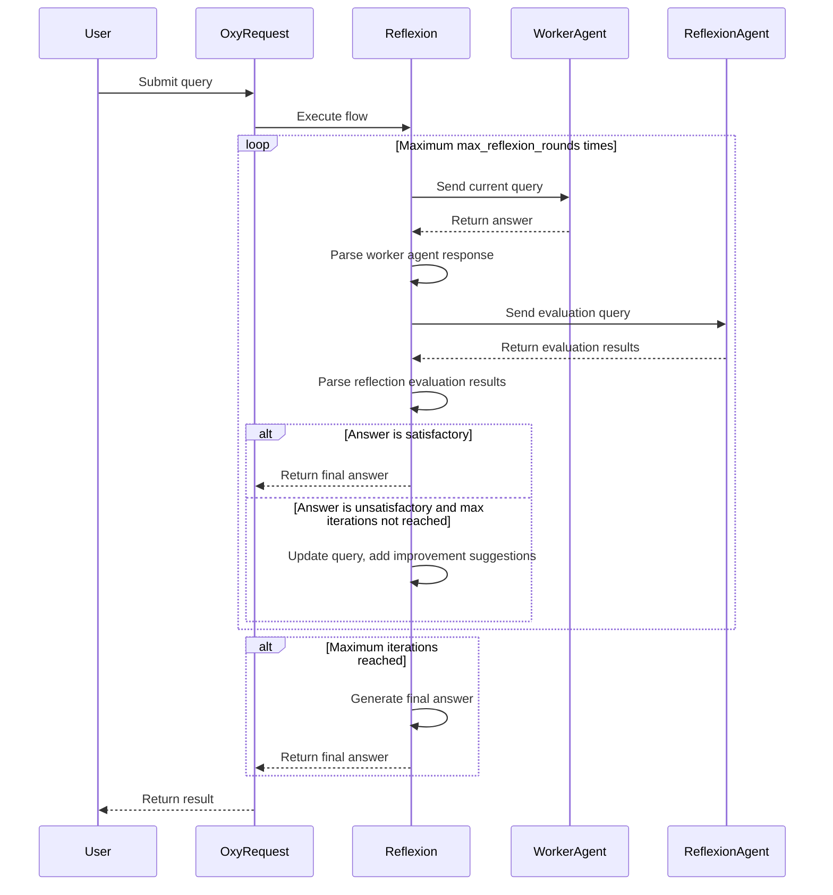

## Overview

The `Reflexion` flow is an advanced mechanism in the OxyGent framework that enables agents to self-evaluate and iteratively optimize their outputs. Through this reflection mechanism, agents identify deficiencies in their responses and continuously improve them, making it suitable for scenarios requiring high-precision outputs such as mathematical calculations, professional consulting, and content creation.

## Architecture



## Parameter Description

### Reflexion Class Parameters

| Parameter Name | Type | Default Value | Description |
|-------|------|-------|------|
| max_reflexion_rounds | int | 3 | Maximum number of reflection iterations |
| worker_agent | str | "worker_agent" | Name of the worker agent |
| reflexion_agent | str | "reflexion_agent" | Name of the reflection agent |
| func_parse_worker_response | Callable | None | Function to parse worker agent responses |
| func_parse_reflexion_response | Callable | None | Function to parse reflection agent responses |
| pydantic_parser_reflexion | PydanticOutputParser | ReflectionEvaluation parser | Parser for reflection results |
| evaluation_template | str | Default evaluation template | Template for evaluation prompts |
| improvement_template | str | Default improvement template | Template for improvement prompts |

### ReflectionEvaluation Class Parameters

| Parameter Name | Type | Description |
|-------|------|------|
| is_satisfactory | bool | Whether the answer is satisfactory |
| evaluation_reason | str | Detailed explanation of the evaluation reasoning |
| improvement_suggestions | str | Specific improvement suggestions if unsatisfactory |

## Workflow



## Context Passing Mechanism

The context passing in the `Reflexion` flow is primarily implemented through the following methods:

1. **Query Updates**: Using the `improvement_template` to combine the original query, current answer, and improvement suggestions into a new query passed to the Worker Agent
2. **OxyRequest**: Serving as the context container for flow execution, persisting throughout the entire execution process
3. **Template Formatting**: Using the `evaluation_template` to pass the original query and current answer to the `Reflexion Agent`
4. **Additional Information**: Passing metadata such as reflection rounds and final evaluation through the `extra` field in the returned `OxyResponse`

## Usage

### Basic Reflexion Flow Configuration

```python
Reflexion(
    name="general_reflexion_flow",
    desc="General reflection process to improve answer quality",
    worker_agent="worker_agent",
    reflexion_agent="reflexion_agent",
    max_reflexion_rounds=3,
)
```

### Math Reflexion Flow Configuration

```python
MathReflexion(
    name="math_reflexion_flow",
    desc="Specialized reflection process for mathematical problems",
    worker_agent="math_expert_agent",
    reflexion_agent="math_checker_agent",
    max_reflexion_rounds=3,
)
```

### Reflexion Flow Configuration with Custom Evaluation Template

```python
Reflexion(
    name="detailed_reflexion_flow",
    desc="Detailed reflection process using custom evaluation criteria",
    worker_agent="detailed_worker_agent",
    reflexion_agent="detailed_reflexion_agent",
    max_reflexion_rounds=5,
    evaluation_template="""Evaluate this answer comprehensively:

Question: {query}
Answer: {answer}

Rate on scale 1-10 for:
- Accuracy and factual correctness
- Completeness of information
- Clarity and readability
- Practical usefulness
- Professional tone

Provide detailed feedback and specific improvement suggestions.

Format:
- is_satisfactory: true/false (true only if all aspects score 8+)
- evaluation_reason: [Detailed scoring and analysis]
- improvement_suggestions: [Specific actionable improvements]""",
)
```

## Advanced Usage

### Custom Reflection Function

```python
def custom_reflexion(response: str, oxy_request: OxyRequest) -> str:
    """Custom reflection function to evaluate answer quality.

    Args:
        response (str): Agent answer to be evaluated
        oxy_request: Current request context

    Returns:
        str: Reflection message if improvement needed; None otherwise
    """
    # Basic checks
    if not response or len(response.strip()) < 5:
        return "Answer is too short or empty. Please provide a more detailed and helpful response."

    # Custom business logic checks
    if "hello" in oxy_request.get_query().lower():
        # For greeting queries, expect friendly responses
        if not any(word in response.lower() for word in ["hello", "hi", "hey", "greetings", "welcome"]):
            return "This is a greeting. Please respond in a more friendly and warm manner."

    # Check for common unhelpful responses
    unhelpful_phrases = [
        "i don't know",
        "i can't help",
        "sorry, i cannot",
        "i'm not sure",
        "not possible"
    ]

    if any(phrase in response.lower() for phrase in unhelpful_phrases):
        return "Your answer doesn't seem helpful. Please try to provide a more constructive answer or suggest alternative solutions."

    return None
```

### Nested Reflection Function

```python
def math_reflexion(response: str, oxy_request: OxyRequest) -> str:
    """Specialized reflection function for mathematical problems."""
    # First apply basic checks
    basic_msg = custom_reflexion(response, oxy_request)
    if basic_msg:
        return basic_msg

    # Math-specific checks
    if any(word in oxy_request.get_query().lower() for word in ["calculate", "compute", "solve", "math", "equation"]):
        # Expect step-by-step solutions
        if "step" not in response.lower() and "=" not in response:
            return "For mathematical problems, please provide a step-by-step solution showing your work process."

    return None
```

### Custom Workflow Implementing Reflection

```python
async def reflexion_workflow(oxy_request: OxyRequest):
    """
    Workflow implementing an external reflection process:
    1. Get user query
    2. Have worker_agent generate initial answer
    3. Have reflexion_agent evaluate answer quality
    4. If unsatisfactory, provide improvement suggestions and regenerate
    5. Return final satisfactory answer
    """

    user_query = oxy_request.get_query(master_level=True)
    max_iterations = 3
    current_iteration = 0

    while current_iteration < max_iterations:
        current_iteration += 1

        # Execute
        worker_resp = await oxy_request.call(
            callee="worker_agent",
            arguments={"query": user_query}
        )
        worker_answer = worker_resp.output

        # Input content for reflection
        evaluation_query = f"""
Please evaluate the quality of the following answer:

Original Question: {user_query}

Answer: {worker_answer}

Please return evaluation results in the following format:
Evaluation Result: [Satisfactory/Unsatisfactory]
Evaluation Reason: [Specific reason]
Improvement Suggestions: [If unsatisfactory, provide specific improvement suggestions]
"""

        reflexion_resp = await oxy_request.call(
            callee="reflexion_agent",
            arguments={"query": evaluation_query}
        )
        reflexion_result = reflexion_resp.output

        # Get reflection results
        if "Satisfactory" in reflexion_result and "Unsatisfactory" not in reflexion_result:
            return f"Final answer optimized through {current_iteration} rounds of reflexion:\n\n{worker_answer}"

        # Update query with reflection results
        improvement_suggestion = ""
        lines = reflexion_result.split('\n')
        for line in lines:
            if "Improvement Suggestions" in line:
                improvement_suggestion = line.split(":", 1)[-1].strip()
                break

        if improvement_suggestion:
            user_query = f"{oxy_request.get_query(master_level=True)}\n\nPlease note the following improvement suggestions: {improvement_suggestion}"

    # If max iterations are used up, return the current best result
    return f"Answer after {max_iterations} rounds of reflexion attempts:\n\n{worker_answer}"
```

## Use Cases

- **High-precision outputs**: Mathematical calculations, technical consulting
- **Content quality improvement**: Writing, documentation, creative content
- **Iterative refinement**: Any scenario requiring multiple improvement cycles
- **Self-evaluation systems**: Agents that need to assess and improve their own work

## API Reference

For complete API documentation including all constructor parameters, methods, and detailed parameter descriptions, see:

**[Reflexion API Reference](/oxyapi/flows-reflexion-api)** - Complete API documentation

## Examples

For practical examples and usage patterns, see:

- [Basic Reflexion](/examples/flows/basic-reflexion) - Quality improvement workflow
- [Math Reflexion](/examples/flows/math-reflexion) - Mathematical problem solving
- [Code Review Reflexion](/examples/flows/code-review) - Iterative code improvement

See all examples in the [Examples Gallery](/examples).

## Related Links

- [Workflow](/docs/flows-workflow) - Custom workflow execution flow
- [ParallelFlow](/docs/flows-parallel) - Parallel execution flow
- [PlanAndSolve](/docs/flows-plan-and-solve) - Plan-and-execute workflow pattern
- [Flow Comparison Guide](/docs/flows-comparison) - Compare all flow types
- [ChatAgent](/docs/agents-chat) - Worker and evaluator agents
- [ReActAgent](/docs/agents-react) - Advanced worker agent
