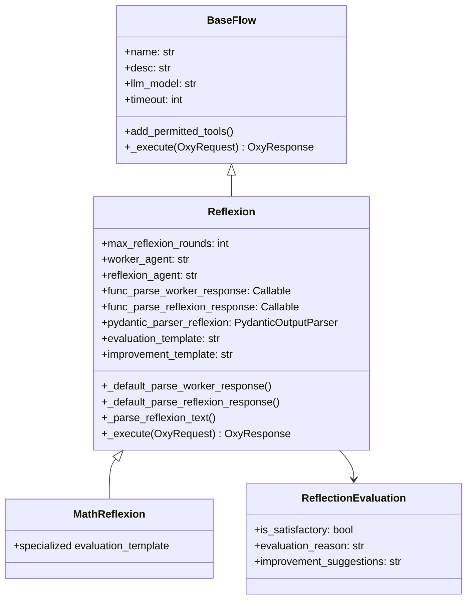
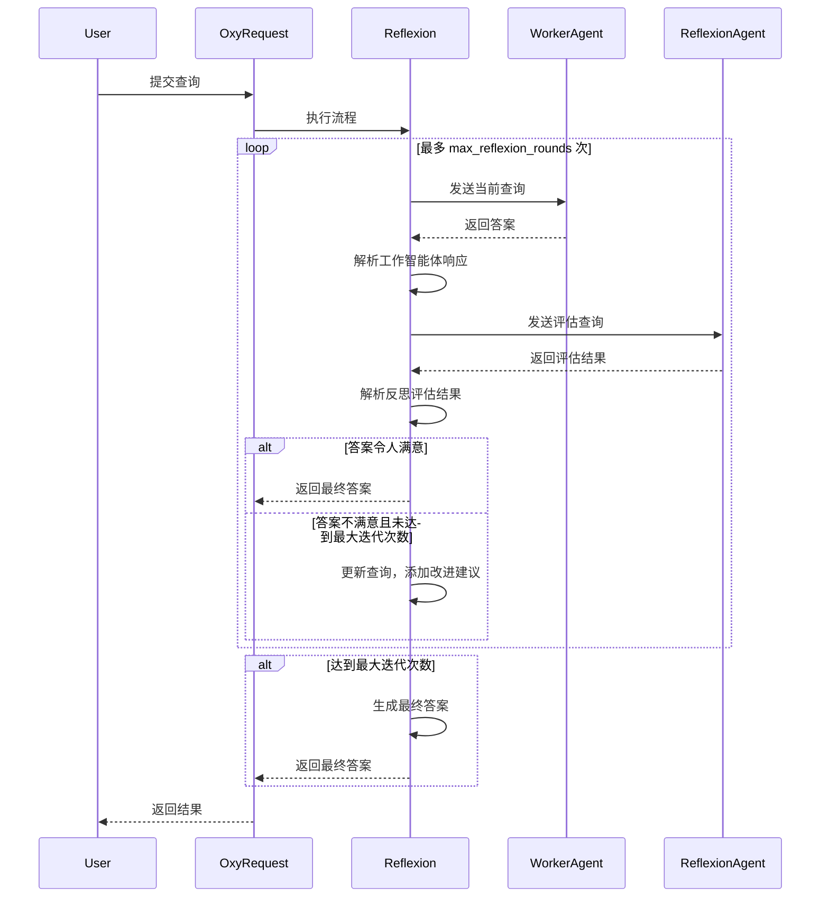

## 概述

`Reflexion` 流程是 OxyGent 框架中的一个高级机制，使智能体能够自我评估和迭代优化其输出。通过这种反思机制，智能体识别其响应中的不足之处并持续改进，使其适用于需要高精度输出的场景，如数学计算、专业咨询和内容创作。

## 架构



## 参数描述

### Reflexion 类参数

| 参数名称 | 类型 | 默认值 | 描述 |
|-------|------|-------|------|
| max_reflexion_rounds | int | 3 | 最大反思迭代次数 |
| worker_agent | str | "worker_agent" | 工作智能体的名称 |
| reflexion_agent | str | "reflexion_agent" | 反思智能体的名称 |
| func_parse_worker_response | Callable | None | 解析工作智能体响应的函数 |
| func_parse_reflexion_response | Callable | None | 解析反思智能体响应的函数 |
| pydantic_parser_reflexion | PydanticOutputParser | ReflectionEvaluation 解析器 | 反思结果的解析器 |
| evaluation_template | str | 默认评估模板 | 评估提示的模板 |
| improvement_template | str | 默认改进模板 | 改进提示的模板 |

### ReflectionEvaluation 类参数

| 参数名称 | 类型 | 描述 |
|-------|------|------|
| is_satisfactory | bool | 答案是否令人满意 |
| evaluation_reason | str | 评估推理的详细解释 |
| improvement_suggestions | str | 如果不满意则提供的具体改进建议 |

## 工作流



## 上下文传递机制

`Reflexion` 流程中的上下文传递主要通过以下方法实现：

1. **查询更新**：使用 `improvement_template` 将原始查询、当前答案和改进建议组合成传递给工作智能体的新查询
2. **OxyRequest**：作为流程执行的上下文容器，在整个执行过程中持久化
3. **模板格式化**：使用 `evaluation_template` 将原始查询和当前答案传递给反思智能体
4. **附加信息**：通过返回的 `OxyResponse` 中的 `extra` 字段传递元数据，如反思轮数和最终评估

## 使用方法

### 基础 Reflexion 流程配置

```python
Reflexion(
    name="general_reflexion_flow",
    desc="改进答案质量的通用反思流程",
    worker_agent="worker_agent",
    reflexion_agent="reflexion_agent",
    max_reflexion_rounds=3,
)
```

### Math Reflexion 流程配置

```python
MathReflexion(
    name="math_reflexion_flow",
    desc="数学问题的专用反思流程",
    worker_agent="math_expert_agent",
    reflexion_agent="math_checker_agent",
    max_reflexion_rounds=3,
)
```

### 使用自定义评估模板的 Reflexion 流程配置

```python
Reflexion(
    name="detailed_reflexion_flow",
    desc="使用自定义评估标准的详细反思流程",
    worker_agent="detailed_worker_agent",
    reflexion_agent="detailed_reflexion_agent",
    max_reflexion_rounds=5,
    evaluation_template="""全面评估这个答案：

问题：{query}
答案：{answer}

在 1-10 的范围内评分：
- 准确性和事实正确性
- 信息完整性
- 清晰度和可读性
- 实用性
- 专业语气

提供详细反馈和具体的改进建议。

格式：
- is_satisfactory: true/false（仅当所有方面得分 8 分以上时为 true）
- evaluation_reason: [详细评分和分析]
- improvement_suggestions: [具体可行的改进措施]""",
)
```

## 高级用法

### 自定义反思函数

```python
def custom_reflexion(response: str, oxy_request: OxyRequest) -> str:
    """自定义反思函数以评估答案质量。

    Args:
        response (str): 要评估的智能体答案
        oxy_request: 当前请求上下文

    Returns:
        str: 如果需要改进则返回反思消息；否则返回 None
    """
    # 基本检查
    if not response or len(response.strip()) < 5:
        return "答案太短或为空。请提供更详细和有帮助的响应。"

    # 自定义业务逻辑检查
    if "hello" in oxy_request.get_query().lower():
        # 对于问候查询，期望友好的响应
        if not any(word in response.lower() for word in ["hello", "hi", "hey", "greetings", "welcome"]):
            return "这是一个问候。请以更友好和温暖的方式响应。"

    # 检查常见的无用响应
    unhelpful_phrases = [
        "i don't know",
        "i can't help",
        "sorry, i cannot",
        "i'm not sure",
        "not possible"
    ]

    if any(phrase in response.lower() for phrase in unhelpful_phrases):
        return "您的答案似乎没有帮助。请尝试提供更具建设性的答案或建议替代解决方案。"

    return None
```

### 嵌套反思函数

```python
def math_reflexion(response: str, oxy_request: OxyRequest) -> str:
    """数学问题的专用反思函数。"""
    # 首先应用基本检查
    basic_msg = custom_reflexion(response, oxy_request)
    if basic_msg:
        return basic_msg

    # 数学特定检查
    if any(word in oxy_request.get_query().lower() for word in ["calculate", "compute", "solve", "math", "equation"]):
        # 期望逐步解决方案
        if "step" not in response.lower() and "=" not in response:
            return "对于数学问题，请提供逐步解决方案，显示您的工作过程。"

    return None
```

### 实现反思的自定义工作流

```python
async def reflexion_workflow(oxy_request: OxyRequest):
    """
    实现外部反思过程的工作流：
    1. 获取用户查询
    2. 让 worker_agent 生成初始答案
    3. 让 reflexion_agent 评估答案质量
    4. 如果不满意，提供改进建议并重新生成
    5. 返回最终满意的答案
    """

    user_query = oxy_request.get_query(master_level=True)
    max_iterations = 3
    current_iteration = 0

    while current_iteration < max_iterations:
        current_iteration += 1

        # 执行
        worker_resp = await oxy_request.call(
            callee="worker_agent",
            arguments={"query": user_query}
        )
        worker_answer = worker_resp.output

        # 输入反思内容
        evaluation_query = f"""
请评估以下答案的质量：

原始问题：{user_query}

答案：{worker_answer}

请使用以下格式返回评估结果：
评估结果：[满意/不满意]
评估原因：[具体原因]
改进建议：[如果不满意，请提供具体的改进建议]
"""

        reflexion_resp = await oxy_request.call(
            callee="reflexion_agent",
            arguments={"query": evaluation_query}
        )
        reflexion_result = reflexion_resp.output

        # 获取反思结果
        if "满意" in reflexion_result and "不满意" not in reflexion_result:
            return f"经过 {current_iteration} 轮反思优化的最终答案：\n\n{worker_answer}"

        # 使用反思结果更新查询
        improvement_suggestion = ""
        lines = reflexion_result.split('\n')
        for line in lines:
            if "改进建议" in line:
                improvement_suggestion = line.split(":", 1)[-1].strip()
                break

        if improvement_suggestion:
            user_query = f"{oxy_request.get_query(master_level=True)}\n\n请注意以下改进建议：{improvement_suggestion}"

    # 如果达到最大迭代次数，返回当前最佳结果
    return f"经过 {max_iterations} 轮反思尝试后的答案：\n\n{worker_answer}"
```

## 使用场景

- **高精度输出**：数学计算、技术咨询
- **内容质量改进**：写作、文档、创意内容
- **迭代精炼**：任何需要多次改进周期的场景
- **自我评估系统**：需要评估和改进自身工作的智能体

## API 参考

完整的 API 文档包括所有构造函数参数、方法和详细的参数描述，请参考：

**[Reflexion API 参考](/oxyapi/flows-reflexion-api)** - 完整的 API 文档

## 示例

实际使用示例和模式请参考：

- [基础 Reflexion](/examples/flows/basic-reflexion) - 质量改进工作流
- [Math Reflexion](/examples/flows/math-reflexion) - 数学问题求解
- [代码审查 Reflexion](/examples/flows/code-review) - 迭代代码改进

查看所有示例：[示例库](/examples)。

## 相关链接

- [工作流](/docs/flows-workflow) - 自定义工作流执行流程
- [ParallelFlow](/docs/flows-parallel) - 并行执行流程
- [PlanAndSolve](/docs/flows-plan-and-solve) - 计划并执行工作流模式
- [流程对比指南](/docs/flows-comparison) - 对比所有流程类型
- [ChatAgent](/docs/agents-chat) - 工作和评估智能体
- [ReActAgent](/docs/agents-react) - 高级工作智能体
